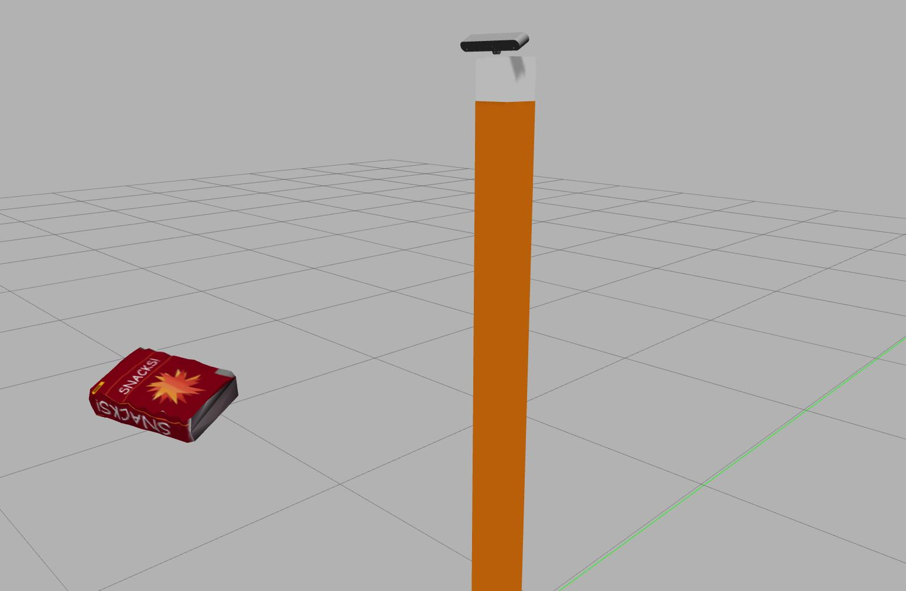
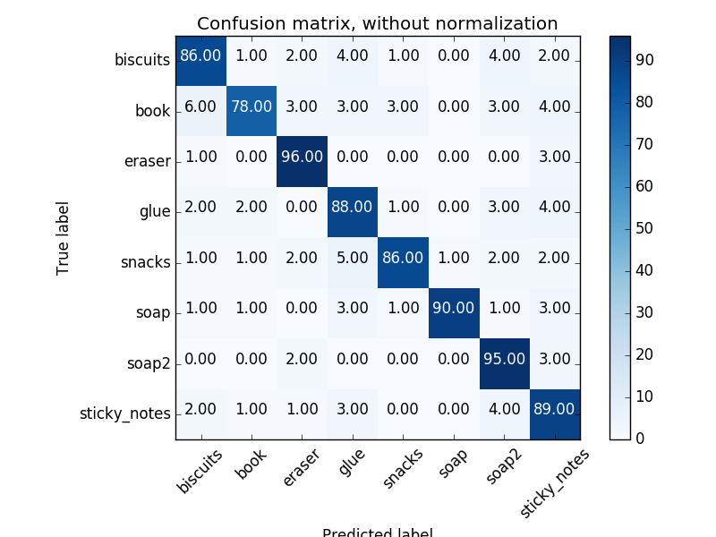
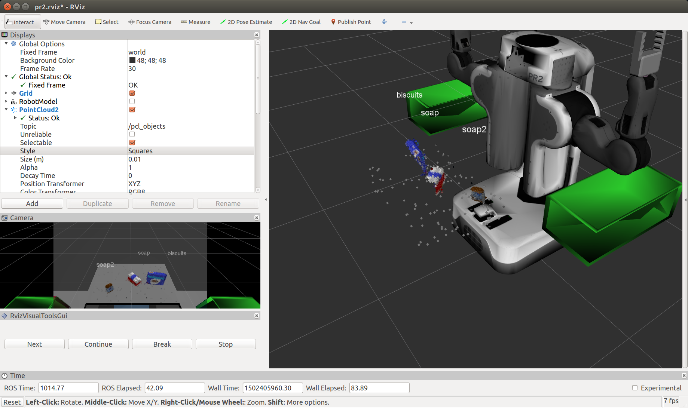
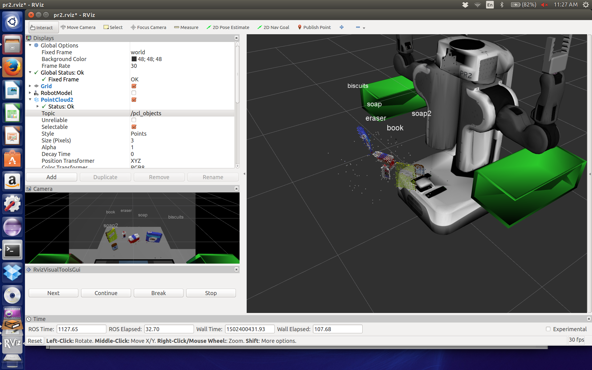
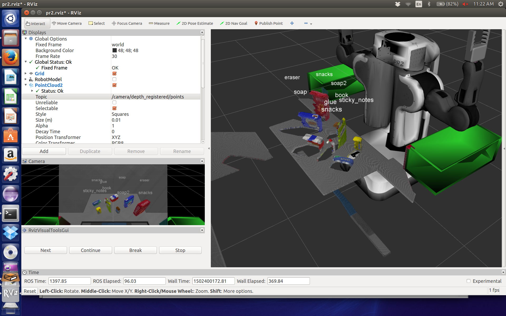
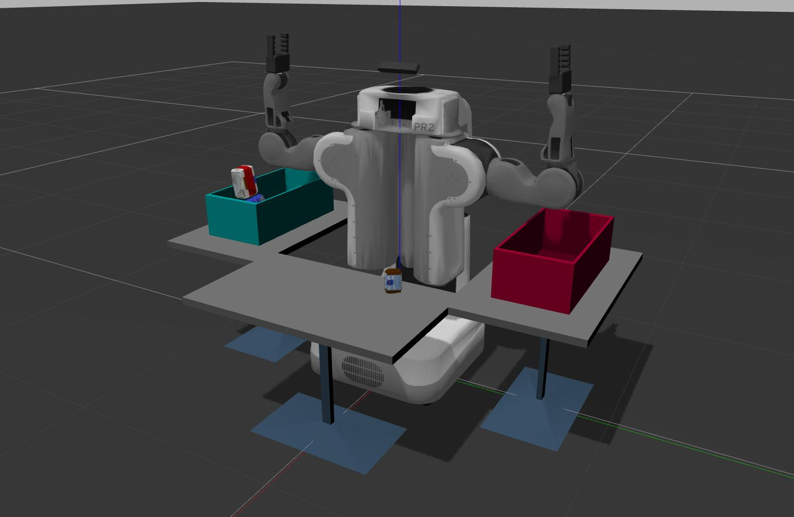
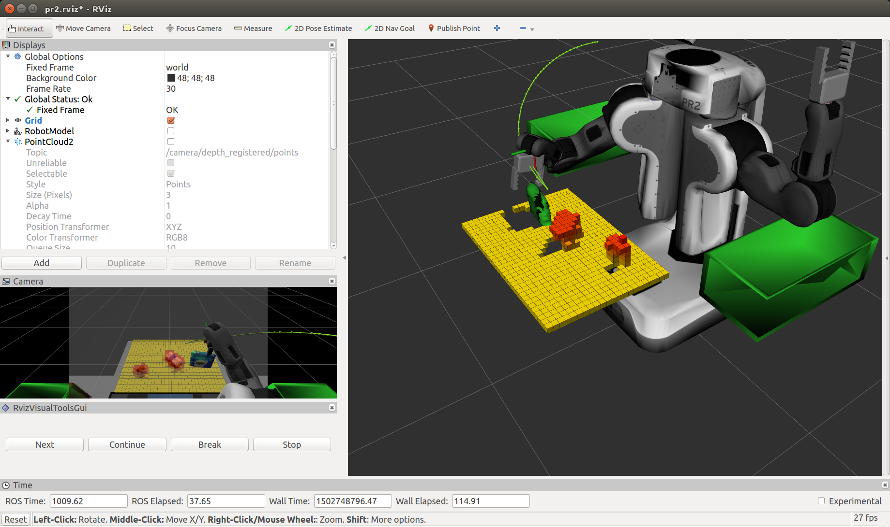
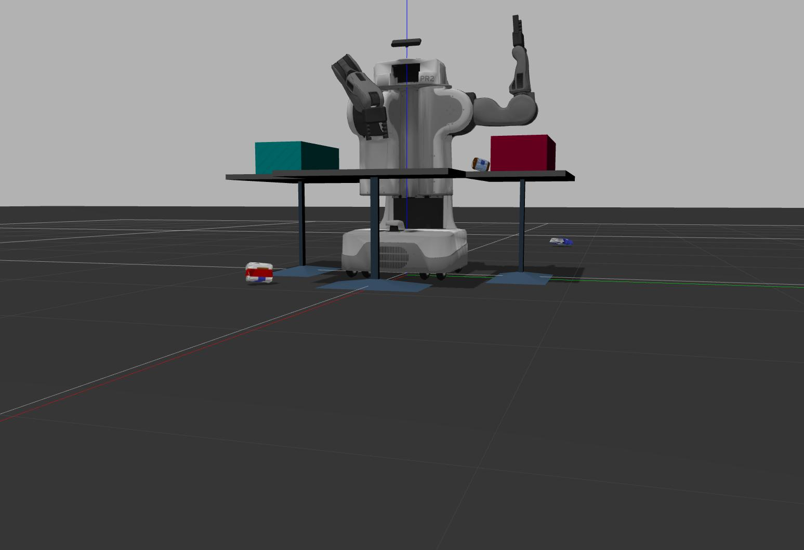
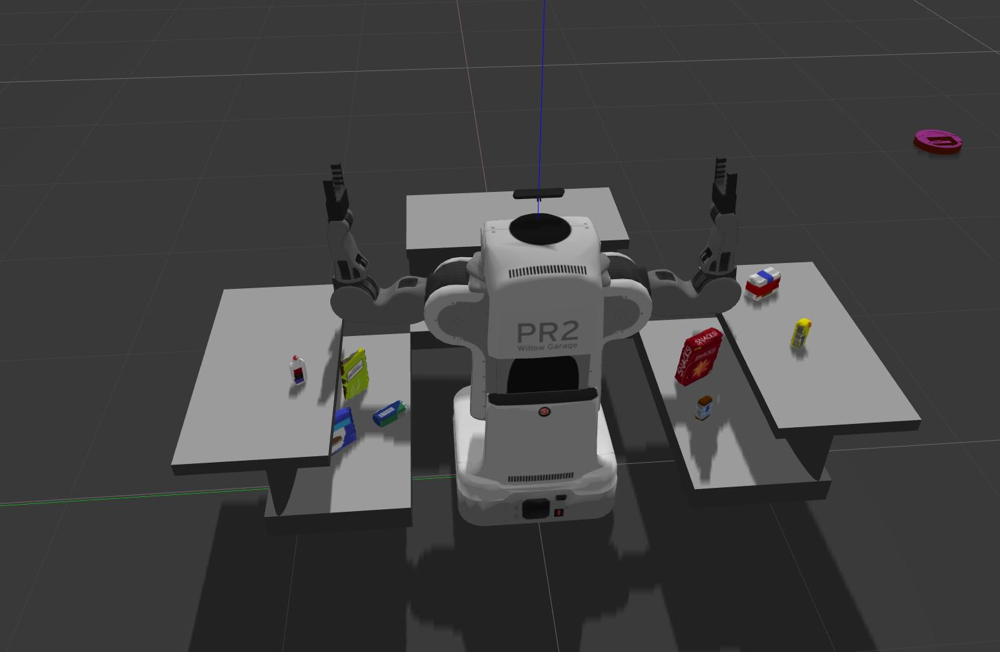

# RoboND-Perception-Project - Perception Pick & Place
---

## Steps Demonstrated in project_template.py:

1. Extracted features and train an SVM model on new objects in `pick_list_*.yaml` in `/pr2_robot/config/`.  I left the sensor_stick project in the src directory, changed the list of models and extracted HSV color and surface normals histogram features, and saved to models.sav. I then reran the svm classifier to create the training set. I only got 76% in the cnofusion matrix, but still that proved to be adequate. See Excercise 3 below for details.
2. Created a ROS node and subscribed to the `/pr2/world/points` topic. This topic contains noisy point cloud data that is filtered with a statistical output filter.
3. Used filtering and RANSAC plane fitting to isolate the objects of interest from the rest of the scene.
4. Applied Euclidean clustering to create separate clusters for individual items.
5. Performed object recognition on these objects and assign them labels as markers in RViz.
6. Calculated the centroid (average in x, y and z) of the set of points belonging to that each object.
7. Created ROS messages containing the details of each object (name, pick_pose, etc.) and writes these messages out to `.yaml` files, one for each of the 3 scenarios (`test1-3.world` in `/pr2_robot/worlds/`).
8. I created a project in my GitHub repo for the project including the Python code for your perception pipeline and the output `.yaml` files (3 `.yaml` files, one for each test world).  I have correctly identified 100% of objects from `pick_list_1.yaml` for `test1.world`, over 80% of items from `pick_list_2.yaml` for `test2.world` and over 75% of items from `pick_list_3.yaml` in `test3.world`. The YAML output files are shown later in the results section.

## Recognition Pipeline

#### Step 1.

Pipeline for filtering and RANSAC plane fitting implemented.

The steps are the following:

1. Downsample the point cloud by applying a Voxel Grid Filter.
2. Add a statistical outlier filter to remove noise from the data.
3. Apply a Passthrough Filter to isolate the table and objects.
4. Perform RANSAC plane fitting to identify the table.
5. Use the Passthrough Filter to create new point clouds containing the table and objects separately.
```

	# Convert ROS msg to PCL data

	cloud = ros_to_pcl(pcl_msg)

	# Create a VoxelGrid filter object for our input point cloud
	vox = cloud.make_voxel_grid_filter()

	# Choose a voxel (also known as leaf) size
	LEAF_SIZE = 0.01

	# Set the voxel (or leaf) size
	vox.set_leaf_size(LEAF_SIZE, LEAF_SIZE, LEAF_SIZE)

	# Call the filter function to obtain the resultant downsampled point cloud
	cloud_filtered = vox.filter()
	
	# Much like the previous filters, we start by creating a filter object: 
	outlier_filter = cloud_filtered.make_statistical_outlier_filter()

	# Set the number of neighboring points to analyze for any given point
	outlier_filter.set_mean_k(50)

	# Set threshold scale factor
	x = 0.05

	# Any point with a mean distance larger than global (mean distance+x*std_dev) will be considered outlier
	outlier_filter.set_std_dev_mul_thresh(x)

	# Finally call the filter function for magic
	cloud_filtered = outlier_filter.filter()
	
	# Create a PassThrough filter object.
	passthrough = cloud_filtered.make_passthrough_filter()

	# Assign axis and range to the passthrough filter object.
	# first filter in y axis to remove bins
	passthrough.set_filter_field_name('y')
	axis_min = -0.4
	axis_max = 0.4
	passthrough.set_filter_limits(axis_min, axis_max)
	x_indices = passthrough.filter()
	cloud_filtered = passthrough.filter()

	# now filter in z axis to remove table and stand
	passthrough = cloud_filtered.make_passthrough_filter()
	passthrough.set_filter_field_name('z')
	axis_min = 0.6
	axis_max = 2.0
	passthrough.set_filter_limits (axis_min, axis_max)

	# Finally use the filter function to obtain the resultant point cloud. 
	cloud_filtered = passthrough.filter()
	
	# RANSAC plane segmentation
	# Create the segmentation object
	seg = cloud_filtered.make_segmenter()

	# Set the model you wish to fit 
	seg.set_model_type(pcl.SACMODEL_PLANE)
	seg.set_method_type(pcl.SAC_RANSAC)

	# Max distance for a point to be considered fitting the model
	# Experiment with different values for max_distance 
	# for segmenting the table
	max_distance = 0.01
	seg.set_distance_threshold(max_distance)

	# Call the segment function to obtain set of inlier indices and model coefficients
	inliers, coefficients = seg.segment()

	# Extract inliers

	cloud_table = cloud_filtered.extract(inliers, negative=False)

	# Extract outliers

	cloud_objects = cloud_filtered.extract(inliers, negative=True)
```
Note that the passthrough filter was called twice, once in the 'y' plane to remove the red and green bins and in the 'z' plane to remove the table top and support.

#### Step 2: 

- I added clustering for segmentation to the pipeline. 
- I created a python ros node that subscribes to /sensor_stick/point_cloud topic.
- I create publishers and topics to publish the segmented table and tabletop objects as separate point clouds
- I applied Euclidean clustering on the table-top objects (after table segmentation is successful)
```
	# Euclidean Clustering

	white_cloud = XYZRGB_to_XYZ(cloud_objects)
	tree = white_cloud.make_kdtree()

	# Create Cluster-Mask Point Cloud to visualize each cluster separately
	# Create a cluster extraction object
	ec = white_cloud.make_EuclideanClusterExtraction()
	# Set tolerances for distance threshold 
	# as well as minimum and maximum cluster size (in points)
	ec.set_ClusterTolerance(0.025)
	ec.set_MinClusterSize(10)
	ec.set_MaxClusterSize(2000)
	# Search the k-d tree for clusters
	ec.set_SearchMethod(tree)
	# Extract indices for each of the discovered clusters
	cluster_indices = ec.Extract()

	#Assign a color corresponding to each segmented object in scene
	cluster_color = get_color_list(len(cluster_indices))

	color_cluster_point_list = []

	for j, indices in enumerate(cluster_indices):
	    for i, index in enumerate(indices):
		color_cluster_point_list.append([white_cloud[index][0],
		                                white_cloud[index][1],
		                                white_cloud[index][2],
		                                 rgb_to_float(cluster_color[j])])

	#Create new cloud containing all clusters, each with unique color
	cluster_cloud = pcl.PointCloud_PointXYZRGB()
	cluster_cloud.from_list(color_cluster_point_list)

	# Convert PCL data to ROS messages

	ros_cloud_table = pcl_to_ros(cloud_table)
	ros_cloud_objects = pcl_to_ros(cloud_objects)
	ros_cluster_cloud = pcl_to_ros(cluster_cloud)

	# Publish ROS messages

	pcl_objects_pub.publish(ros_cloud_objects)
	pcl_table_pub.publish(ros_cloud_table)
	pcl_cluster_pub.publish(ros_cluster_cloud)
```
- I created a XYZRGB point cloud such that each cluster obtained from the previous step has its own unique color.
- I published the colored cluster cloud on a separate topic `pcl_cluster`.
```
# Create Subscribers

	pcl_sub = rospy.Subscriber("/pr2/world/points", PointCloud2, pcl_callback, queue_size=1)

	# Create Publishers

	pcl_objects_pub = rospy.Publisher("/pcl_objects", PointCloud2, queue_size=1)
	pcl_table_pub = rospy.Publisher("/pcl_table", PointCloud2, queue_size=1)
	pcl_cluster_pub = rospy.Publisher("/pcl_cluster", PointCloud2, queue_size=1)
	pcl_collision_pub = rospy.Publisher("/pr2/3d_map/points", PointCloud2, queue_size=1)
	
	pub_body = rospy.Publisher('/pr2/world_joint_controller/command', Float64, queue_size=1)

	# Create object_markers_pub and detected_objects_pub
	# Publish to "/object_markers" and "/detected_objects", respectively
	object_markers_pub = rospy.Publisher("/object_markers", Marker, queue_size=1)
	detected_objects_pub = rospy.Publisher("/detected_objects", DetectedObjectsArray, queue_size=1)

	# Load Model From disk
	model = pickle.load(open('model.sav', 'rb'))
	clf = model['classifier']
	encoder = LabelEncoder()
	encoder.classes_ = model['classes']
	scaler = model['scaler']
```

#### Step 3  

I this step I extracted color and normals histogram features and trained using an SVM linear classifier.

I implemented the `compute_color_histograms()` and `compute_normal_histograms()` functions within features.py in /sensor_stick/src/sensor_stick to generate correct histogram results:
```
def compute_color_histograms(cloud, using_hsv=False, nbins=32):

    # Compute histograms for the clusters
    point_colors_list = []

    # Step through each point in the point cloud
    for point in pc2.read_points(cloud, skip_nans=True):
        rgb_list = float_to_rgb(point[3])
        if using_hsv:
            point_colors_list.append(rgb_to_hsv(rgb_list) * 255)
        else:
            point_colors_list.append(rgb_list)

    # Populate lists with color values
    channel_1_vals = []
    channel_2_vals = []
    channel_3_vals = []

    for color in point_colors_list:
        channel_1_vals.append(color[0])
        channel_2_vals.append(color[1])
        channel_3_vals.append(color[2])
    
    # Compute histograms
    channel_1_hist = np.histogram(channel_1_vals, bins=nbins, range=(0,256))
    channel_2_hist = np.histogram(channel_2_vals, bins=nbins, range=(0,256))
    channel_3_hist = np.histogram(channel_3_vals, bins=nbins, range=(0,256))
    # Concatenate and normalize the histograms
    hist_features = np.concatenate((channel_1_hist[0], channel_2_hist[0], channel_3_hist[0])).astype(np.float64)
    normed_features = hist_features / np.sum(hist_features)

    return normed_features


def compute_normal_histograms(normal_cloud, nbins=32):
    norm_x_vals = []
    norm_y_vals = []
    norm_z_vals = []

    for norm_component in pc2.read_points(normal_cloud,
                                          field_names = ('normal_x', 'normal_y', 'normal_z'),
                                          skip_nans=True):
        norm_x_vals.append(norm_component[0])
        norm_y_vals.append(norm_component[1])
        norm_z_vals.append(norm_component[2])

    # Compute histograms of normal values (just like with color)
    norm_x_hist = np.histogram(norm_x_vals, bins=nbins, range=(0.,1.))
    norm_y_hist = np.histogram(norm_y_vals, bins=nbins, range=(0.,1.))
    norm_z_hist = np.histogram(norm_z_vals, bins=nbins, range=(0.,1.))
    # Concatenate and normalize the histograms
    norms_features = np.concatenate((norm_x_hist[0], norm_y_hist[0], norm_z_hist[0])).astype(np.float64)
    normed_features = norms_features / np.sum(norms_features)

    return normed_features
```

#### Training Environment

I launched the training.launch file to bring up the Gazebo environment:

`roslaunch sensor_stick training.launch`

#### Capturing Features

I ran the capture_features.py script to capture and save features for each of the objects in the environment. This script spawns each object in random orientations (I used 10 orientations per object) and computed features based on the point clouds resulting from each of the random orientations.

`rosrun sensor_stick capture_features.py`

The features were captured as the objects were being spawned in various orientations in Gazebo. It took about 5 sec. for each random orientation. When it finished the results were stored in a training_set.sav file. The models in `capture_features.py` were:
```
   models = [\
       'biscuits',
       'book',
       'snacks',
       'eraser',
       'glue',
       'sticky_notes',
       'soap',
       'soap2']
```

Here is an example of the sensor stick during training:



#### Training

I ran the train_svm.py model to train an SVM classifier on the labeled set of features.

`rosrun sensor_stick train_svm.py`

With these results for a training set of 100 scans, and using a linear kernel.

```
doug@doug-Ubuntu:~/catkin_ws$ rosrun sensor_stick train_svm.py
Features in Training Set: 800
Invalid Features in Training set: 0
Scores for linear kernel: [ 0.90625  0.8875   0.86875  0.88125  0.88125]
Accuracy: 0.89 (+/- 0.02)
accuracy score: 0.885
```

### Other Changes

#### Changes to pick_place_project.launch

Made changes as suggested on Slack to locate the scene number in a signle location:
```
	<!--TODO:Change the test number based on the scene you want loaded-->
	<arg name="test_scene_num" value="1"/>
	
	   <!--TODO:Change the world name to load different tabletop setup-->
	   <arg name="world_name" value="$(find pr2_robot)/worlds/test$(arg test_scene_num).world"/>

	<!--TODO:Change the list name based on the scene you have loaded-->
	  <param name="test_scene_num" type="int" value="$(arg test_scene_num)"/>
	  <rosparam command="load" file="$(find pr2_robot)/config/pick_list_$(arg test_scene_num).yaml"/>

```

#### Modifications to `main`

I added argument parsing to main to selectivley excercise various parts of the pipeline:
```
	test_scene_num = Int32()

	pipeline_only = False			# for testing, just do the recoginition pipeline and skip PR2 movement
	with_collision_map = False		# calculate the collision map for challenge.world
	with_object_collision_map = False	# calculate the object collision map
	yaml_only = False			# true if only yaml output is desired, and no robot motion

	turn = 0.0				# current turn angle - 0.0 = front facing

	left_done = False
	right_done = False
	center_done = False

	# Parse arguments

	parser = argparse.ArgumentParser()
	parser.add_argument("-v", "--verbose", help="increase output verbosity",
                    action="store_true")
	parser.add_argument("-p", "--pipeline_only", help="pipeline only, no PR2 movement",
                    action="store_true")
	parser.add_argument("-y", "--yaml_only", help="YAML only, no PR2 movement",
                    action="store_true")
	parser.add_argument("-o", "--with_object_collision_map", help="add object collision map",
                    action="store_true")
	parser.add_argument("-m", "--with_collision_map", help="add table collision map",
                    action="store_true")

	args = parser.parse_args()

	if args.verbose:
    		print "verbosity turned on"

	if args.pipeline_only:
    		print "pipeline_only turned on"
		pipeline_only = True

	if args.yaml_only:
    		print "yaml_only turned on"
		yaml_only = True

	if args.with_collision_map:
    		print "with_collision_map turned on"
		with_collision_map = True

	if args.with_object_collision_map:
    		print "with_object_collision_map turned on"
		with_object_collision_map = True
```

#### Function `ros_to_pcl2`

A helper function that concatenates two PointCloud2 ROS messages into a single PCL Point Cloud.

```
def ros_to_pcl2(ros_cloud1, ros_cloud2):
    """ Appends two ROS PointCloud2 ROS messages to a single pcl PointXYZRGB
    
        Args:
            ros_cloud (PointCloud2, PointCloud2): ROS PointCloud2 messages
            
        Returns:
            pcl.PointCloud_PointXYZRGB: PCL XYZRGB point cloud
    """
    points_list = []

    for data in pc2.read_points(ros_cloud1, skip_nans=True):
        points_list.append([data[0], data[1], data[2], data[3]])

    for data in pc2.read_points(ros_cloud2, skip_nans=True):
        points_list.append([data[0], data[1], data[2], data[3]])

    pcl_data = pcl.PointCloud_PointXYZRGB()
    pcl_data.from_list(points_list)

    return pcl_data

```

Which I used when creating a composite collision map of the table and the objects not being picked up:

```
	# First publish all object not in the request list as collision objects
	if with_object_collision_map == True:
		ros_composite_map = pcl_to_ros(collision_map)
	    	for the_object in detected_objects_list:
		    if the_object.label != object_name.data:
			pcl_composite_map = ros_to_pcl2(ros_composite_map, the_object.cloud)	# append the new object to the collision map
			ros_composite_map = pcl_to_ros(pcl_composite_map)
			print "Publishing %s as a collision object of %s" % (the_object.label, object_name.data)

		pcl_collision_pub.publish(ros_composite_map)

```

### Results

<center>

| ***Confusion Matrix*** |
|:-------------:|
|  |
| *** 89% score, not great, but adequate *** |

#### Test Images Showing Labeling

| ***Test Output*** |
|:-------------:|
|  |
| ***Test 1 -  3 of 3 objects found and labeled *** |
|  |
| ***Test 2 - 5 of 5 objects found and labeled *** |
|  |
| ***Test 3 - 8 of 8 objects found and labeled *** |

#### Sample Command Line Trace

```
doug@doug-Ubuntu:~/catkin_ws$ rosrun pr2_robot project_template.py with_object_collision_map
With Object Collision map
[INFO] [1502750226.971035, 986.352000]: Detected 1 objects: ['biscuits']
[INFO] [1502750227.201833, 986.395000]: Detected 2 objects: ['biscuits', 'soap']
[INFO] [1502750227.349699, 986.414000]: Detected 3 objects: ['biscuits', 'soap', 'soap2']
Request to pick up biscuits in group green
Publishing soap as a collision object of biscuits
Publishing soap2 as a collision object of biscuits
Found biscuits at: 0.542226 -0.243688 0.705338
Scene 1, picking up object biscuits that I found, with my right arm, and placing it in the green bin.
Response to pick_place_routine service request:  True
Scene 1: 1 of 1 objects moved to bin.
Request to pick up soap in group green
Publishing biscuits as a collision object of soap
Publishing soap2 as a collision object of soap
Found soap at: 0.540899 -0.019530 0.672708
Scene 1, picking up object soap that I found, with my right arm, and placing it in the green bin.
Response to pick_place_routine service request:  True
Scene 1: 2 of 2 objects moved to bin.
Request to pick up soap2 in group red
Publishing biscuits as a collision object of soap2
Publishing soap as a collision object of soap2
Found soap2 at: 0.444292 0.227145 0.674390
Scene 1, picking up object soap2 that I found, with my left arm, and placing it in the red bin.

```

#### Test 1 YAML

```
object_list:
- arm_name: right
  object_name: biscuits
  pick_pose:
    orientation:
      w: 0.0
      x: 0.0
      y: 0.0
      z: 0.0
    position:
      x: 0.5422409772872925
      y: -0.24230962991714478
      z: 0.7053117752075195
  place_pose:
    orientation:
      w: 0.0
      x: 0.0
      y: 0.0
      z: 0.0
    position:
      x: -0.1
      y: -0.71
      z: 0.605
  test_scene_num: 1
- arm_name: right
  object_name: soap
  pick_pose:
    orientation:
      w: 0.0
      x: 0.0
      y: 0.0
      z: 0.0
    position:
      x: 0.5407626032829285
      y: -0.020037328824400902
      z: 0.6735755801200867
  place_pose:
    orientation:
      w: 0.0
      x: 0.0
      y: 0.0
      z: 0.0
    position:
      x: -0.1
      y: -0.71
      z: 0.605
  test_scene_num: 1
- arm_name: left
  object_name: soap2
  pick_pose:
    orientation:
      w: 0.0
      x: 0.0
      y: 0.0
      z: 0.0
    position:
      x: 0.44517120718955994
      y: 0.22279632091522217
      z: 0.6767338514328003
  place_pose:
    orientation:
      w: 0.0
      x: 0.0
      y: 0.0
      z: 0.0
    position:
      x: -0.1
      y: 0.71
      z: 0.605
  test_scene_num: 1
```

#### Test 2 YAML

```object_list:
- arm_name: right
  object_name: biscuits
  pick_pose:
    orientation:
      w: 0.0
      x: 0.0
      y: 0.0
      z: 0.0
    position:
      x: 0.5715519189834595
      y: -0.2491622269153595
      z: 0.7049819231033325
  place_pose:
    orientation:
      w: 0.0
      x: 0.0
      y: 0.0
      z: 0.0
    position:
      x: -0.1
      y: -0.71
      z: 0.605
  test_scene_num: 2
- arm_name: right
  object_name: soap
  pick_pose:
    orientation:
      w: 0.0
      x: 0.0
      y: 0.0
      z: 0.0
    position:
      x: 0.5601557493209839
      y: 0.00291590578854084
      z: 0.6745651364326477
  place_pose:
    orientation:
      w: 0.0
      x: 0.0
      y: 0.0
      z: 0.0
    position:
      x: -0.1
      y: -0.71
      z: 0.605
  test_scene_num: 2
- arm_name: left
  object_name: book
  pick_pose:
    orientation:
      w: 0.0
      x: 0.0
      y: 0.0
      z: 0.0
    position:
      x: 0.581922709941864
      y: 0.27770471572875977
      z: 0.7205572128295898
  place_pose:
    orientation:
      w: 0.0
      x: 0.0
      y: 0.0
      z: 0.0
    position:
      x: -0.1
      y: 0.71
      z: 0.605
  test_scene_num: 2
- arm_name: left
  object_name: soap2
  pick_pose:
    orientation:
      w: 0.0
      x: 0.0
      y: 0.0
      z: 0.0
    position:
      x: 0.44417712092399597
      y: 0.22744213044643402
      z: 0.6747559905052185
  place_pose:
    orientation:
      w: 0.0
      x: 0.0
      y: 0.0
      z: 0.0
    position:
      x: -0.1
      y: 0.71
      z: 0.605
  test_scene_num: 2
- arm_name: left
  object_name: glue
  pick_pose:
    orientation:
      w: 0.0
      x: 0.0
      y: 0.0
      z: 0.0
    position:
      x: 0.6312971115112305
      y: 0.13123351335525513
      z: 0.6794822812080383
  place_pose:
    orientation:
      w: 0.0
      x: 0.0
      y: 0.0
      z: 0.0
    position:
      x: -0.1
      y: 0.71
      z: 0.605
  test_scene_num: 2
```
#### Test 3 YAML

```
object_list:
- arm_name: left
  object_name: sticky_notes
  pick_pose:
    orientation:
      w: 0.0
      x: 0.0
      y: 0.0
      z: 0.0
    position:
      x: 0.43881526589393616
      y: 0.21614859998226166
      z: 0.6775033473968506
  place_pose:
    orientation:
      w: 0.0
      x: 0.0
      y: 0.0
      z: 0.0
    position:
      x: -0.1
      y: 0.71
      z: 0.605
  test_scene_num: 3
- arm_name: left
  object_name: book
  pick_pose:
    orientation:
      w: 0.0
      x: 0.0
      y: 0.0
      z: 0.0
    position:
      x: 0.49250367283821106
      y: 0.08392732590436935
      z: 0.7257388234138489
  place_pose:
    orientation:
      w: 0.0
      x: 0.0
      y: 0.0
      z: 0.0
    position:
      x: -0.1
      y: 0.71
      z: 0.605
  test_scene_num: 3
- arm_name: right
  object_name: snacks
  pick_pose:
    orientation:
      w: 0.0
      x: 0.0
      y: 0.0
      z: 0.0
    position:
      x: 0.42306026816368103
      y: -0.32529428601264954
      z: 0.7492565512657166
  place_pose:
    orientation:
      w: 0.0
      x: 0.0
      y: 0.0
      z: 0.0
    position:
      x: -0.1
      y: -0.71
      z: 0.605
  test_scene_num: 3
- arm_name: left
  object_name: eraser
  pick_pose:
    orientation:
      w: 0.0
      x: 0.0
      y: 0.0
      z: 0.0
    position:
      x: 0.5897160768508911
      y: -0.22023411095142365
      z: 0.7037498950958252
  place_pose:
    orientation:
      w: 0.0
      x: 0.0
      y: 0.0
      z: 0.0
    position:
      x: -0.1
      y: 0.71
      z: 0.605
  test_scene_num: 3
- arm_name: left
  object_name: eraser
  pick_pose:
    orientation:
      w: 0.0
      x: 0.0
      y: 0.0
      z: 0.0
    position:
      x: 0.6022871732711792
      y: 0.2850668430328369
      z: 0.6450653076171875
  place_pose:
    orientation:
      w: 0.0
      x: 0.0
      y: 0.0
      z: 0.0
    position:
      x: -0.1
      y: 0.71
      z: 0.605
  test_scene_num: 3
- arm_name: right
  object_name: soap2
  pick_pose:
    orientation:
      w: 0.0
      x: 0.0
      y: 0.0
      z: 0.0
    position:
      x: 0.4538024961948395
      y: -0.043528828769922256
      z: 0.6739063262939453
  place_pose:
    orientation:
      w: 0.0
      x: 0.0
      y: 0.0
      z: 0.0
    position:
      x: -0.1
      y: -0.71
      z: 0.605
  test_scene_num: 3
- arm_name: right
  object_name: soap
  pick_pose:
    orientation:
      w: 0.0
      x: 0.0
      y: 0.0
      z: 0.0
    position:
      x: 0.6758374571800232
      y: 0.006406047847121954
      z: 0.6731306910514832
  place_pose:
    orientation:
      w: 0.0
      x: 0.0
      y: 0.0
      z: 0.0
    position:
      x: -0.1
      y: -0.71
      z: 0.605
  test_scene_num: 3
- arm_name: left
  object_name: glue
  pick_pose:
    orientation:
      w: 0.0
      x: 0.0
      y: 0.0
      z: 0.0
    position:
      x: 0.6097415685653687
      y: 0.14362695813179016
      z: 0.6717910170555115
  place_pose:
    orientation:
      w: 0.0
      x: 0.0
      y: 0.0
      z: 0.0
    position:
      x: -0.1
      y: 0.71
      z: 0.605
  test_scene_num: 3
  ```

### Extra Challenges: The Pick & Place

9. I created a collision map by publishing a point cloud to the `/pr2/3d_map/points` topic and changed the `point_cloud_topic` to `/pr2/3d_map/points` in `sensors.yaml` in the `/pr2_robot/config/` directory. This topic is read by Moveit!, which uses this point cloud input to generate a collision map, allowing the robot to plan its trajectory.  The issue here is that when you go to pick up an object, you must first remove it from this point cloud so it is removed from the collision map!
10. I rotated the robot to generate collision map of table sides. This was accomplished by publishing joint angle value (in radians) to `/pr2/world_joint_controller/command`. I adapted the code from a prvious project to pr=erform the movement:
```
# PR2 movement support routines

# ... close enough
def at_goal(pos, goal):
    tolerance = .05
    result = abs(pos - goal) <= abs(tolerance)
    return result

# the wait arguments determines whether or not this is a blocking call
def turn_pr2(pos, wait=True):
    time_elapsed = rospy.Time.now()
    pub_body.publish(pos)
    loc = 0.0

    joint_state = rospy.wait_for_message('/pr2/joint_states', JointState)
    loc = joint_state.position[19]	# the world link
        
    while wait:
        joint_state = rospy.wait_for_message('/pr2/joint_states', JointState)
        loc = joint_state.position[19]
 	if at_goal(loc, pos):
 	   #print "turn_pr2: Request: %f Joint %s=%f" % (pos, joint_state.name[19], joint_state.position[19])
           time_elapsed = joint_state.header.stamp - time_elapsed
           break

    return loc
```
I then called `turn_pr2` in the project_template.py `pr_mover()` function:
```
    	# Rotate PR2 in place to capture side tables for the collision map
	# Note that turn_pr2 is a non-blocking call so the request is made
	# and then repeatedly checked in each callback against the goal
	# when the goal is reached, the next scan is initiated, until
	# return to center is achieved
	if with_collision_map == True and center_done == False:
		print "Sending command to scan for obstacles..."
		if right_done == False:
			turn = turn_pr2(-np.pi/2.0,False)	# right
			print "Turning right at %f radians now." % turn
			if at_goal(turn, -np.pi/2.0):
				right_done = True
		elif left_done == False:
        		turn = turn_pr2(np.pi/2.0,False)	# left
 			print "Turning left at %f radians now." % turn
			if at_goal(turn, np.pi/2.0):
				left_done = True
	       	elif center_done == False:
 			turn = turn_pr2(0.0,False)		# back home
			print "Centering at %f radians now." % turn
			if at_goal(turn, 0.0):
				center_done = True
```
Note that this code is conditionally called as it is very slow to execute. After visiting the right turn and left turn I rotated the robot back to its original state, in the 3rd call to turn_pr2 to 0.0 radians.

11. The main body of `pr2_mover` located the objects from the request list in the detected objects list, calculated the centroids of the objects and finally called the pick_place_routine to move the PR2, and saved the output in a YAML file.
```
    for i in range(len(object_list_param)):
	request_count += 1
    	# Parse parameters into individual variables
	object_name.data = object_list_param[i]['name']
	object_group.data = object_list_param[i]['group']
	print "Request to pick up %s in group %s" % (object_name.data, object_group.data)
	
	# First publish all object not in the request list as collision objects
	if with_object_collision_map == True:
		ros_composite_map = pcl_to_ros(collision_map)
	    	for the_object in detected_objects_list:
		    if the_object.label != object_name.data:
			pcl_composite_map = ros_to_pcl2(ros_composite_map, the_object.cloud)	# append the new object to the collision map
			ros_composite_map = pcl_to_ros(pcl_composite_map)
			print "Publishing %s as a collision object of %s" % (the_object.label, object_name.data)

		pcl_collision_pub.publish(ros_composite_map)

   	# Loop through the pick list and look for the requested object
    	for the_object in detected_objects_list:
	    match_count = 0
	    if the_object.label == object_name.data:
		match_count += 1

		# Get the PointCloud for a given object and obtain it's centroid
		labels.append(the_object.label)
		points_arr = ros_to_pcl(the_object.cloud).to_array()
		centroid = np.mean(points_arr, axis=0)[:3]
		centroid = [np.asscalar(centroid[0]),np.asscalar(centroid[1]),np.asscalar(centroid[2])]
		centroids.append(centroid)
		print "Found %s at: %f %f %f" % (object_name.data, centroid[0], centroid[1], centroid[2])

        	# Assign the arm to be used for pick_place
		if object_group.data == 'green':
		    arm_name.data = 'right'
		    place_pose.position.x = -0.1-float(success_count)*0.2	# move back a little bit for each object
		    place_pose.position.y = -0.71				# so as not to stack...
		    place_pose.position.z = 0.605
		else:
		    arm_name.data = 'left'
		    place_pose.position.x = -0.1-float(success_count)*0.2
		    place_pose.position.y = 0.71
		    place_pose.position.z = 0.605

		pick_pose.position.x = centroid[0]
		pick_pose.position.y = centroid[1]
		pick_pose.position.z = centroid[2]

		print "Scene %d, picking up object %s that I found, with my %s arm, and placing it in the %s bin." % (test_scene_num.data, object_name.data, arm_name.data, object_group.data)

        	# Create a list of dictionaries (made with make_yaml_dict()) for later output to yaml format
		yaml_dict = make_yaml_dict(test_scene_num, arm_name, object_name, pick_pose, place_pose)
		dict_list.append(yaml_dict)
```
12. I created a ROS Client for the “pick_place_routine” rosservice:
```
	
		if yaml_only == False:
	
        		# Wait for 'pick_place_routine' service to come up
        		rospy.wait_for_service('pick_place_routine')

			try:
				pick_place_routine = rospy.ServiceProxy('pick_place_routine', PickPlace)

```
13. I passed the messages to the `pick_place_routine` service, and the selected arm performed the pick and place operations and displayed the trajectory in the RViz window.
```
				# Insert message variables to be sent as a service request
				resp = pick_place_routine(test_scene_num, object_name, arm_name, pick_pose, place_pose)

				print "Response to pick_place_routine service request: ", resp.success
				if resp.success == True:
					success_count += 1

        		except rospy.ServiceException, e:
				print "Service call failed: %s" % e
```
14. I only placed two of the three objects from the pick list for test1.world in their respective dropoff box and could not complete the challenge by adding all three. 



Completing this task required adding the objects that the PR2 was not currently picking up to the collision map. The reason for this is that the PR2 arm is programmed to go erratic after placing the object with the effect of knocking the remaining objects on the table all over the room - and thus preventing task completion. I created the composite collision map of the table and the object not currently being picked up as below:



Collision map with objects not being picked up added to map.
```
	# First publish all object not in the request list as collision objects
	if with_object_collision_map == True:
		ros_composite_map = pcl_to_ros(collision_map)
	    	for the_object in detected_objects_list:
		    if the_object.label != object_name.data:
			pcl_composite_map = ros_to_pcl2(ros_composite_map, the_object.cloud)	# append the new object to the collision map
			ros_composite_map = pcl_to_ros(pcl_composite_map)
			print "Publishing %s as a collision object of %s" % (the_object.label, object_name.data)

		pcl_collision_pub.publish(ros_composite_map)
```

I  wrote `ros_to_pcl2`, a function that concatenates to ros messages and creates a composite map.

I also had trouble with the PR2 not picking up the objects. I noted that the world models had empty entries for friction. So I added friction:

```
          <surface>
            <friction>
              <ode mu="10.0" mu2="10.0" fdir1="0 0 0" slip1="0" slip2="0"/>
            </friction>
            <bounce restitution_coefficient="0" threshold="1000000.0"/>
            <contact>
              <ode soft_cfm="0" soft_erp="0.2" kp="1e10" kd="1" max_vel="100.0" min_depth="0.0001"/>
            </contact>
          </surface>
```
This helped in picking up the objects. I got the values from the ROS WIki Tutorial 'Create you own world': http://wiki.ros.org/cob_gazebo_worlds/Tutorials/Create%20your%20own%20world
Other fixes such as waiting longer to grip were ineffective.

But, after these fixes, I still had much random behavior:



Food was flyting everywhere!

15. I loaded up the `challenge.world` scenario to try to get the perception pipeline working there.


To make the models and worlds more consistent I copied challenge.world to test4.world and test3.yaml to test4.yaml. In this way I could just set the scene number to 4 to run the challenge. I added a command line parameter `with_collision_map` to enable scanning for objects to the left and right of center.

But, it required more changes and tuning than I could accomplish in time to meet the project deadline...

### Next Steps

As the worlds got more complex I could see that the filters were very specific to a world. If the world changed the filers would all have to be retuned. That works OK for an industrial situation where the robot does just one job in one place and needs to be retrained for a different job. Somehow though if recognition were improves so that so many specific filters are note required in the pipeline, I think that robot could be more adaptable.

I noticed that the inverse kinematics are very rough. It was hard to complete the challenge of putting all the parts even for test1 world in bins because the arm movements were so erratic. Some work could be done to improve the inverse kinematics.


