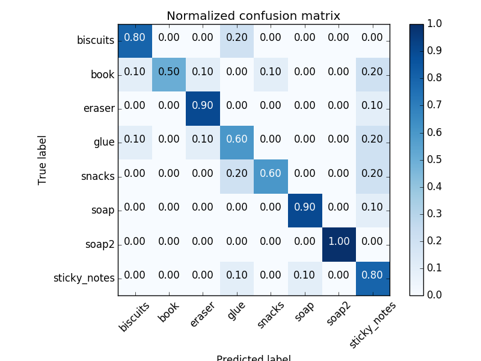

# RoboND-Perception-Project
## Project: Perception Pick & Place

---

## The Steps Demonstrated in project_template.py:

1. Extracts features and train an SVM model on new objects in `pick_list_*.yaml` in `/pr2_robot/config/`. 
2. Creates a ROS node and subscribes to the `/pr2/world/points` topic. This topic contains noisy point cloud data that is filtered with a statistical output filter.
3. Uses filtering and RANSAC plane fitting to isolate the objects of interest from the rest of the scene.
4. Applies Euclidean clustering to create separate clusters for individual items.
5. Performs object recognition on these objects and assign them labels as markers in RViz.
6. Calculates the centroid (average in x, y and z) of the set of points belonging to that each object.
7. Creates ROS messages containing the details of each object (name, pick_pose, etc.) and writes these messages out to `.yaml` files, one for each of the 3 scenarios (`test1-3.world` in `/pr2_robot/worlds/`).
8. I created a project in my GitHub repo for the project including the Python code for your perception pipeline and the output `.yaml` files (3 `.yaml` files, one for each test world).  I have correctly identified 100% of objects from `pick_list_1.yaml` for `test1.world`, over 80% of items from `pick_list_2.yaml` for `test2.world` and over 75% of items from `pick_list_3.yaml` in `test3.world`.

## Extra Challenges: The Pick & Place

9. I created a collision map by publishing a point cloud to the `/pr2/3d_map/points` topic and changed the `point_cloud_topic` to `/pr2/3d_map/points` in `sensors.yaml` in the `/pr2_robot/config/` directory. This topic is read by Moveit!, which uses this point cloud input to generate a collision map, allowing the robot to plan its trajectory.  Keep in mind that later when you go to pick up an object, you must first remove it from this point cloud so it is removed from the collision map!
10. Rotate the robot to generate collision map of table sides. This can be accomplished by publishing joint angle value(in radians) to `/pr2/world_joint_controller/command`.
11. Rotate the robot back to its original state.
12. Create a ROS Client for the “pick_place_routine” rosservice.  In the required steps above, you already created the messages you need to use this service. Checkout the [PickPlace.srv](https://github.com/udacity/RoboND-Perception-Project/tree/master/pr2_robot/srv) file to find out what arguments you must pass to this service.
13. If everything was done correctly, when you pass the appropriate messages to the `pick_place_routine` service, the selected arm will perform pick and place operation and display trajectory in the RViz window
14. Place all the objects from your pick list in their respective dropoff box and you have completed the challenge!
15. Looking for a bigger challenge?  Load up the `challenge.world` scenario and see if you can get your perception pipeline working there!

### Recognition Pipeline

#### 1. Exercise 1. 

Pipeline for filtering and RANSAC plane fitting implemented.

#### 2. Exercise 2: 

Pipeline including clustering for segmentation implemented.  

#### 3. Exercise 3  

Features extracted and SVM trained.  Object recognition implemented.

<center>

| ***Confusion Matrix*** |
|:-------------:|
|  |
| *** 76% score, not great, but adequate *** |

## Test Images Showing Labeling

| ***Test Output*** |
|:-------------:|
|  |
| ***Test 1 -  3 of 3 objects found and labeled *** |
|  |
| ***Test 2 - 5 of 5 objects found and labeled *** |
|  |
| ***Test 3 - 8 of 8 objects found and labeled *** |

### Test 1 YAML

```
object_list:
- arm_name: right
  object_name: biscuits
  pick_pose:
    orientation:
      w: 0.0
      x: 0.0
      y: 0.0
      z: 0.0
    position:
      x: 0.5422409772872925
      y: -0.24230962991714478
      z: 0.7053117752075195
  place_pose:
    orientation:
      w: 0.0
      x: 0.0
      y: 0.0
      z: 0.0
    position:
      x: -0.1
      y: -0.71
      z: 0.605
  test_scene_num: 1
- arm_name: right
  object_name: soap
  pick_pose:
    orientation:
      w: 0.0
      x: 0.0
      y: 0.0
      z: 0.0
    position:
      x: 0.5407626032829285
      y: -0.020037328824400902
      z: 0.6735755801200867
  place_pose:
    orientation:
      w: 0.0
      x: 0.0
      y: 0.0
      z: 0.0
    position:
      x: -0.1
      y: -0.71
      z: 0.605
  test_scene_num: 1
- arm_name: left
  object_name: soap2
  pick_pose:
    orientation:
      w: 0.0
      x: 0.0
      y: 0.0
      z: 0.0
    position:
      x: 0.44517120718955994
      y: 0.22279632091522217
      z: 0.6767338514328003
  place_pose:
    orientation:
      w: 0.0
      x: 0.0
      y: 0.0
      z: 0.0
    position:
      x: -0.1
      y: 0.71
      z: 0.605
  test_scene_num: 1
```

### Test 2 YAML

```object_list:
- arm_name: right
  object_name: biscuits
  pick_pose:
    orientation:
      w: 0.0
      x: 0.0
      y: 0.0
      z: 0.0
    position:
      x: 0.5715519189834595
      y: -0.2491622269153595
      z: 0.7049819231033325
  place_pose:
    orientation:
      w: 0.0
      x: 0.0
      y: 0.0
      z: 0.0
    position:
      x: -0.1
      y: -0.71
      z: 0.605
  test_scene_num: 2
- arm_name: right
  object_name: soap
  pick_pose:
    orientation:
      w: 0.0
      x: 0.0
      y: 0.0
      z: 0.0
    position:
      x: 0.5601557493209839
      y: 0.00291590578854084
      z: 0.6745651364326477
  place_pose:
    orientation:
      w: 0.0
      x: 0.0
      y: 0.0
      z: 0.0
    position:
      x: -0.1
      y: -0.71
      z: 0.605
  test_scene_num: 2
- arm_name: left
  object_name: book
  pick_pose:
    orientation:
      w: 0.0
      x: 0.0
      y: 0.0
      z: 0.0
    position:
      x: 0.581922709941864
      y: 0.27770471572875977
      z: 0.7205572128295898
  place_pose:
    orientation:
      w: 0.0
      x: 0.0
      y: 0.0
      z: 0.0
    position:
      x: -0.1
      y: 0.71
      z: 0.605
  test_scene_num: 2
- arm_name: left
  object_name: soap2
  pick_pose:
    orientation:
      w: 0.0
      x: 0.0
      y: 0.0
      z: 0.0
    position:
      x: 0.44417712092399597
      y: 0.22744213044643402
      z: 0.6747559905052185
  place_pose:
    orientation:
      w: 0.0
      x: 0.0
      y: 0.0
      z: 0.0
    position:
      x: -0.1
      y: 0.71
      z: 0.605
  test_scene_num: 2
- arm_name: left
  object_name: glue
  pick_pose:
    orientation:
      w: 0.0
      x: 0.0
      y: 0.0
      z: 0.0
    position:
      x: 0.6312971115112305
      y: 0.13123351335525513
      z: 0.6794822812080383
  place_pose:
    orientation:
      w: 0.0
      x: 0.0
      y: 0.0
      z: 0.0
    position:
      x: -0.1
      y: 0.71
      z: 0.605
  test_scene_num: 2
```
### Test 3 YAML

```
object_list:
- arm_name: left
  object_name: sticky_notes
  pick_pose:
    orientation:
      w: 0.0
      x: 0.0
      y: 0.0
      z: 0.0
    position:
      x: 0.43881526589393616
      y: 0.21614859998226166
      z: 0.6775033473968506
  place_pose:
    orientation:
      w: 0.0
      x: 0.0
      y: 0.0
      z: 0.0
    position:
      x: -0.1
      y: 0.71
      z: 0.605
  test_scene_num: 3
- arm_name: left
  object_name: book
  pick_pose:
    orientation:
      w: 0.0
      x: 0.0
      y: 0.0
      z: 0.0
    position:
      x: 0.49250367283821106
      y: 0.08392732590436935
      z: 0.7257388234138489
  place_pose:
    orientation:
      w: 0.0
      x: 0.0
      y: 0.0
      z: 0.0
    position:
      x: -0.1
      y: 0.71
      z: 0.605
  test_scene_num: 3
- arm_name: right
  object_name: snacks
  pick_pose:
    orientation:
      w: 0.0
      x: 0.0
      y: 0.0
      z: 0.0
    position:
      x: 0.42306026816368103
      y: -0.32529428601264954
      z: 0.7492565512657166
  place_pose:
    orientation:
      w: 0.0
      x: 0.0
      y: 0.0
      z: 0.0
    position:
      x: -0.1
      y: -0.71
      z: 0.605
  test_scene_num: 3
- arm_name: left
  object_name: eraser
  pick_pose:
    orientation:
      w: 0.0
      x: 0.0
      y: 0.0
      z: 0.0
    position:
      x: 0.5897160768508911
      y: -0.22023411095142365
      z: 0.7037498950958252
  place_pose:
    orientation:
      w: 0.0
      x: 0.0
      y: 0.0
      z: 0.0
    position:
      x: -0.1
      y: 0.71
      z: 0.605
  test_scene_num: 3
- arm_name: left
  object_name: eraser
  pick_pose:
    orientation:
      w: 0.0
      x: 0.0
      y: 0.0
      z: 0.0
    position:
      x: 0.6022871732711792
      y: 0.2850668430328369
      z: 0.6450653076171875
  place_pose:
    orientation:
      w: 0.0
      x: 0.0
      y: 0.0
      z: 0.0
    position:
      x: -0.1
      y: 0.71
      z: 0.605
  test_scene_num: 3
- arm_name: right
  object_name: soap2
  pick_pose:
    orientation:
      w: 0.0
      x: 0.0
      y: 0.0
      z: 0.0
    position:
      x: 0.4538024961948395
      y: -0.043528828769922256
      z: 0.6739063262939453
  place_pose:
    orientation:
      w: 0.0
      x: 0.0
      y: 0.0
      z: 0.0
    position:
      x: -0.1
      y: -0.71
      z: 0.605
  test_scene_num: 3
- arm_name: right
  object_name: soap
  pick_pose:
    orientation:
      w: 0.0
      x: 0.0
      y: 0.0
      z: 0.0
    position:
      x: 0.6758374571800232
      y: 0.006406047847121954
      z: 0.6731306910514832
  place_pose:
    orientation:
      w: 0.0
      x: 0.0
      y: 0.0
      z: 0.0
    position:
      x: -0.1
      y: -0.71
      z: 0.605
  test_scene_num: 3
- arm_name: left
  object_name: glue
  pick_pose:
    orientation:
      w: 0.0
      x: 0.0
      y: 0.0
      z: 0.0
    position:
      x: 0.6097415685653687
      y: 0.14362695813179016
      z: 0.6717910170555115
  place_pose:
    orientation:
      w: 0.0
      x: 0.0
      y: 0.0
      z: 0.0
    position:
      x: -0.1
      y: 0.71
      z: 0.605
  test_scene_num: 3
  ```

Spend some time at the end to discuss your code, what techniques you used, what worked and why, where the implementation might fail and how you might improve it if you were going to pursue this project further.  


